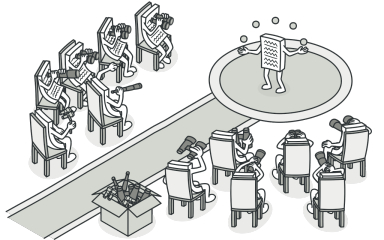

# Projeto - Programação Reativa na Linguagem Imperativa 2

## Universidade Federal de Pernambuco  
**Centro de Informática**  
**Disciplina:** IN1007 2025.1 - **Paradigmas de Linguagens de Programação**  

## Equipe
- **Bruna Alves Wanderley de Siqueira** - [baws@cin.ufpe.br](mailto:baws@cin.ufpe.br)  
- **Matheus Frej Lemos Cavalcanti** - [mflc@cin.ufpe.br](mailto:mflc@cin.ufpe.br)  
- **Gustavo Prazeres Paz do Nascimento** - [gppn@cin.ufpe.br](mailto:gppn@cin.ufpe.br)  

## Introdução
Este projeto tem como objetivo a redefinição da **Backus-Naur Form (BNF)** proposta na Linguagem Imperativa 2, para que seja capaz de implementar o paradigma [Reativo](https://en.wikipedia.org/wiki/Reactive_programming). A programação reativa é um paradigma de programação declarativa preocupado com fluxos de dados e a propagação de mudanças. Com esse paradigma, é possível expressar fluxos de dados estáticos (por exemplo, arrays) ou dinâmicos (por exemplo, emissores de eventos) com facilidade.

A maioria dos frameworks de frontend, como **React**, **Vue** e **Angular**, utilizam esse paradigma para propagar atualizações para a [DOM](https://developer.mozilla.org/pt-BR/docs/Web/API/Document_Object_Model/Introduction) (Document Object Model) a partir de mudanças em variáveis reativas. Outro exemplo é uma linguagem de descrição de hardware como Verilog, onde a programação reativa permite que as mudanças sejam modeladas à medida que se propagam pelos circuitos.

## Programação Reativa e o Padrão Observer

O paradigma reativo está intimamente ligado ao padrão de projeto [Observer](https://refactoring.guru/design-patterns/observer), um padrão comportamental que define um mecanismo de assinatura (pub/sub), no qual múltiplos objetos (observadores) são automaticamente notificados sempre que o estado de outro objeto (publicador) é alterado.

- Publisher (Sujeito): objeto que possui um estado interessante a ser monitorado.

- Subscribers (Observadores): objetos interessados nas mudanças desse estado.

O Publisher mantém uma lista de subscribers e:

- Notifica todos os observadores quando ocorre uma mudança;

- Possui métodos públicos que permitem adicionar e remover observadores da lista.

## Objetivos
Ao final do curso, a linguagem terá suporte a:

- Variáveis reativas;

- Observadores de variáveis reativas.

Este repositório contém os arquivos e implementações necessárias para a adição de programação reativa na Linguagem Imperativa 2.

---
Abaixo está a **Backus-Naur Form (BNF)** atualizada para a Linguagem Imperativa 2. As classes **em negrito** indicam as partes que foram adicionadas ou alteradas para suportar a programação reativa.

## BNF
<h3> Imperativa 2 Reativa</h3>

[Programa](PLP/Imperativa2/src/li2/plp/imperative2/Programa.java) ::= [Comando](PLP/Imperativa2/src/li2/plp/imperative1/command/Comando.java )

Comando ::= [Atribuicao](PLP/Imperativa2/src/li2/plp/imperative1/command/Atribuicao.java)

&emsp; &emsp; &emsp; &emsp;  &ensp;| [ComandoDeclaracao](PLP/Imperativa2/src/li2/plp/imperative1/command/ComandoDeclaracao.java)

&emsp; &emsp; &emsp; &emsp;  &ensp;| [While](PLP/Imperativa2/src/li2/plp/imperative1/command/While.java)

&emsp; &emsp; &emsp; &emsp;  &ensp;| [IfThenElse](PLP/Imperativa2/src/li2/plp/imperative1/command/IfThenElse.java)

&emsp; &emsp; &emsp; &emsp;  &ensp;| [IO](PLP/Imperativa2/src/li2/plp/imperative1/command/IO.java)

&emsp; &emsp; &emsp; &emsp;  &ensp;| [SequenciaComando](PLP/Imperativa2/src/li2/plp/imperative1/command/SequenciaComando.java) Comando ";" Comando

&emsp; &emsp; &emsp; &emsp;  &ensp;| [Skip](PLP/Imperativa2/src/li2/plp/imperative1/command/Skip.java)

&emsp; &emsp; &emsp; &emsp;  &ensp;| [ChamadaProcedimento](PLP/Imperativa2/src/li2/plp/imperative2/command/ChamadaProcedimento.java)

Skip ::= 

Atribuicao ::= [Id](PLP/Imperativa2/src/li2/plp/expressions2/expression/Id.java) ":=" [Expressao](PLP/Imperativa2/src/li2/plp/expressions2/expression/Expressao.java)

Expressao ::= [Valor](PLP/Imperativa2/src/li2/plp/expressions2/expression/Valor.java) | [ExpUnaria](PLP/Imperativa2/src/li2/plp/expressions2/expression/ExpUnaria.java) | [ExpBinaria](PLP/Imperativa2/src/li2/plp/expressions2/expression/ExpBinaria.java ) | Id

Valor ::= [ValorConcreto](PLP/Imperativa2/src/li2/plp/expressions2/expression/ValorConcreto.java)

ValorConcreto ::= [ValorInteiro](PLP/Imperativa2/src/li2/plp/expressions2/expression/ValorInteiro.java ) 
| [ValorBooleano](PLP/Imperativa2/src/li2/plp/expressions2/expression/ValorBooleano.java) 
| [ValorString](PLP/Imperativa2/src/li2/plp/expressions2/expression/ValorString.java)

ExpUnaria ::= [ExpMenos](PLP/Imperativa2/src/li2/plp/expressions2/expression/ExpMenos.java ) "-" Expressao | [ExpNot](PLP/Imperativa2/src/li2/plp/expressions2/expression/ExpNot.java ) "not" Expressao | [ExpLenght](PLP/Imperativa2/src/li2/plp/expressions2/expression/ExpLength.java) "lenght" Expressao

ExpBinaria ::=  [ExpSoma](PLP/Imperativa2/src/li2/plp/expressions2/expression/ExpSoma.java) Expressao "+" Expressao

&emsp; &emsp; &emsp; &emsp;  &ensp;| [ExpSub](PLP/Imperativa2/src/li2/plp/expressions2/expression/ExpSub.java) Expressao "-" Expressao

&emsp; &emsp; &emsp; &emsp;  &ensp;| [ExpAnd](PLP/Imperativa2/src/li2/plp/expressions2/expression/ExpAnd.java) Expressao "and" Expressao

&emsp; &emsp; &emsp; &emsp;  &ensp;| [ExpOr](PLP/Imperativa2/src/li2/plp/expressions2/expression/ExpOr.java) Expressao "or" Expressao

&emsp; &emsp; &emsp; &emsp;  &ensp;| [ExpEquals](PLP/Imperativa2/src/li2/plp/expressions2/expression/ExpEquals.java) Expressao "==" Expressao

&emsp; &emsp; &emsp; &emsp;  &ensp;| [ExpConcat](PLP/Imperativa2/src/li2/plp/expressions2/expression/ExpConcat.java) Expressao "++" Expressao

ComandoDeclaracao :: = "{" [Declaracao](PLP/Imperativa2/src/li2/plp/imperative1/declaration/Declaracao.java) ";" Comando "}"

Declaracao ::= [DeclaracaoVariavel](PLP/Imperativa2/src/li2/plp/imperative1/declaration/DeclaracaoVariavel.java)

&emsp; &emsp; &emsp; &emsp;  &ensp;| [DeclaracaoProcedimento](PLP/Imperativa2/src/li2/plp/imperative2/declaration/DeclaracaoProcedimento.java)

&emsp; &emsp; &emsp; &emsp;  &ensp;| [DeclaracaoComposta](PLP/Imperativa2/src/li2/plp/imperative1/declaration/DeclaracaoComposta.java)

&emsp; &emsp; &emsp; &emsp;  &ensp;| [**DeclaracaoObservador**](PLP/Imperativa2/src/li2/plp/imperative2/declaration/DeclaracaoObservador.java)

**DeclaracaoVariavel ::= DeclaracaoVariavelReativa | DeclaracaoVariavelSimples**

&emsp; &emsp; &emsp; &emsp;  &ensp;| [**DeclaracaoVariavelReativa**](PLP/Imperativa2/src/li2/plp/imperative2/declaration/DeclaracaoVariavelReativa.java) ::= "react" Id "=" Expressao

&emsp; &emsp; &emsp; &emsp;  &ensp;| [**DeclaracaoVariavelSimples**](PLP/Imperativa2/src/li2/plp/imperative2/declaration/DeclaracaoVariavelSimples.java) ::= "var" Id "=" Expressao 

DeclaracaoComposta ::= Declaracao "," Declaracao

DeclaracaoProcedimento ::= [DeclaracaoProcedimento](PLP/Imperativa2/src/li2/plp/imperative2/declaration/DeclaracaoProcedimento.java) "proc" Id "(" [ ListaDeclaracaoParametro ] ")" "{" Comando "}"

DeclaracaoObservador ::= [DeclaracaoObservador](PLP/Imperativa2/src/li2/plp/imperative2/declaration/DeclaracaoObservador.java) "watch" Id "(" [ ListaExpressao ] ")" "{" Comando "}"

ListaDeclaracaoParametro ::= [DeclaracaoParametro](PLP/Imperativa2/src/li2/plp/imperative2/declaration/DeclaracaoParametro.java) Tipo Id |\
 &emsp; &emsp; &emsp; &emsp;  &ensp;| [ListaDeclaracaoParametro](PLP/Imperativa2/src/li2/plp/imperative2/declaration/ListaDeclaracaoParametro.java) Tipo Id "," ListaDeclaracaoParametro

Tipo ::= "string" | "int" | "boolean"

While ::= "while" Expressao "do" Comando

IfThenElse ::= "if" Expressao "then" Comando "else" Comando

IO ::= [Write](PLP/Imperativa2/src/li2/plp/imperative1/command/Write.java) "write" "(" Expressao ")" | [Read](PLP/Imperativa2/src/li2/plp/imperative1/command/Read.java) "read" "(" Id ")"

ChamadaProcedimento ::= "call" Id "(" [[ ListaExpressao ]](PLP/Imperativa2/src/li2/plp/imperative2/command/ListaExpressao.java) ")" 

ListaExpressao ::= Expressao | Expressao, ListaExpressao

---
### Classes Auxiliares
[AmbienteExecucaoImperativa2](PLP/Imperativa2/src/li2/plp/imperative2/memory/AmbienteExecucaoImperativa2.java)  
[ContextoExecucaoImperativa2](PLP/Imperativa2/src/li2/plp/imperative2/memory/ContextoExecucaoImperativa2.java)  
[ListaValor](PLP/Imperativa2/src/li2/plp/imperative1/memory/ListaValor.java)  
[DefProcedimento](PLP/Imperativa2/src/li2/plp/imperative2/declaration/DefProcedimento.java)  
[**DefReativo**](PLP/Imperativa2/src/li2/plp/imperative2/declaration/DefReativo.java)  
[ProcedimentoJaDeclaradoException](PLP/Imperativa2/src/li2/plp/imperative2/memory/ProcedimentoJaDeclaradoException.java)  
[ProcedimentoNaoDeclaradoException](PLP/Imperativa2/src/li2/plp/imperative2/memory/ProcedimentoNaoDeclaradoException.java)  
[**Publisher**](PLP/Imperativa2/src/li2/plp/imperative2/observer/Publisher.java)  
[**Subscriber**](PLP/Imperativa2/src/li2/plp/imperative2/observer/Subscriber.java)  
[**VariavelReativaPublisher**](PLP/Imperativa2/src/li2/plp/imperative2/observer/VariavelReativaPublisher.java)  
[**VariavelReativaJaDeclaradaException**](PLP/Imperativa2/src/li2/plp/imperative2/memory/VariavelReativaJaDeclaradaException.java)  
[**VariavelReativaNaoDeclaradaException**](PLP/Imperativa2/src/li2/plp/imperative2/memory/VariavelReativaNaoDeclaradaException.java)  

---
### Parser
[Imperative2](PLP/Imperativa2/src/li2/plp/imperative2/parser/Imperative2.jj)
